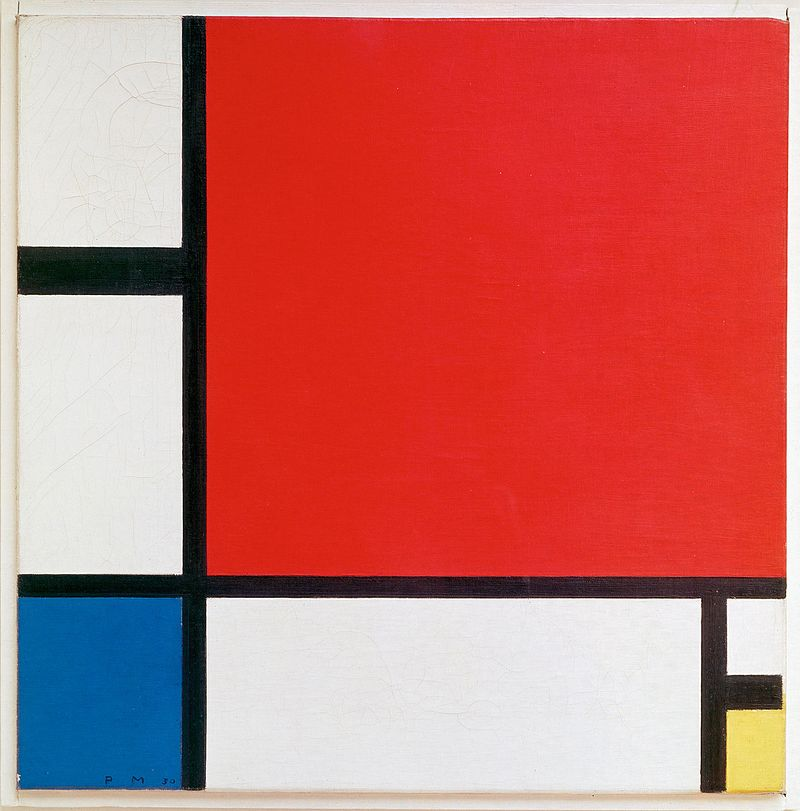

# Mondrian Grid
I recreated Piet Mondrian's "Composition II with Red Blue and Yellow" using CSS Grid then applied some simple Javascript to make the entire piece visible on any sized screen. Also, the color cells light up when you click them.

[See it here](https://parkerdavis1.github.io/mondrian/)

Original:

